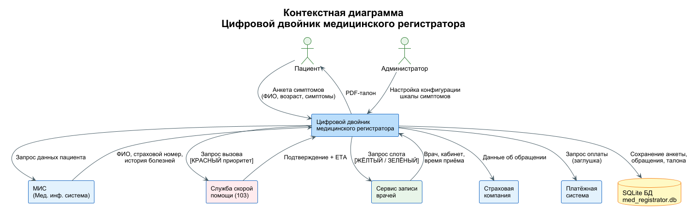
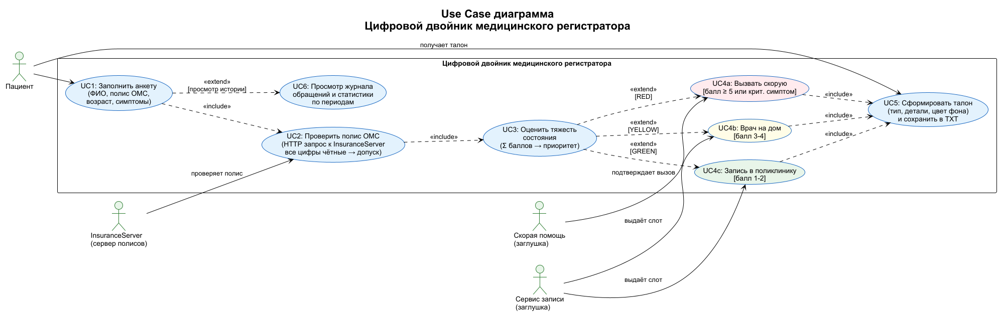
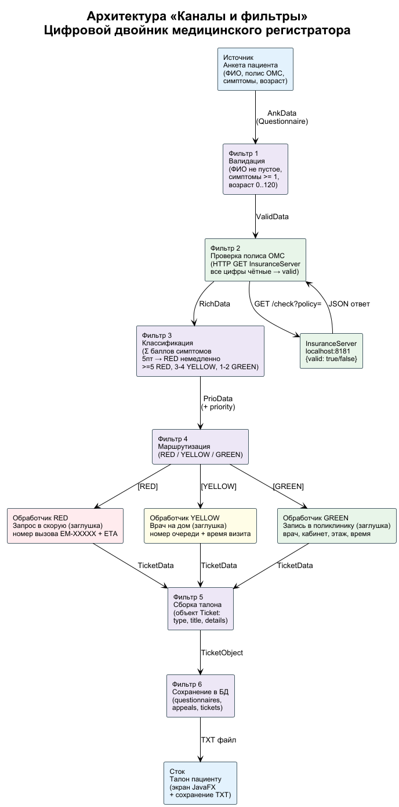
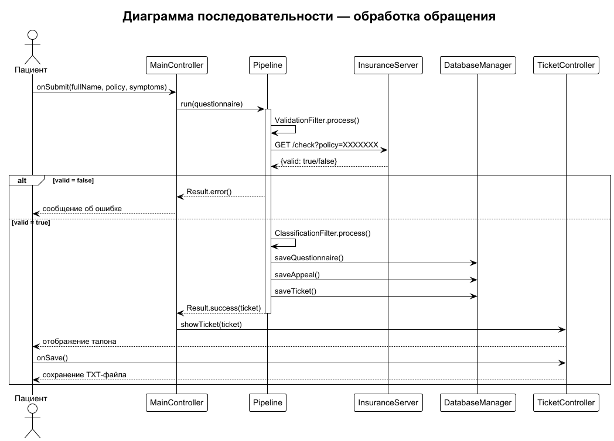
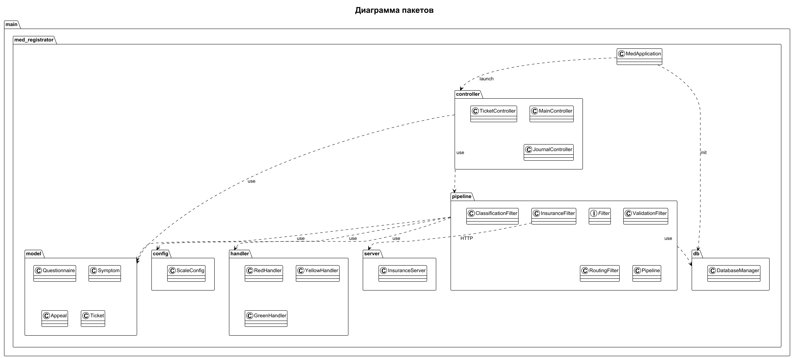
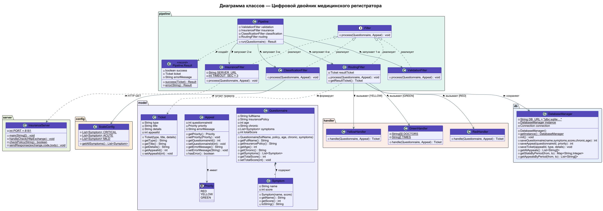
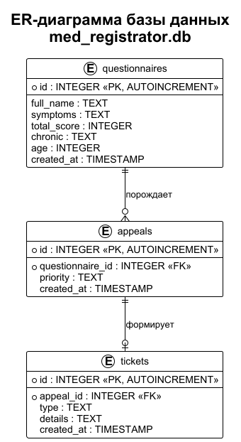

# Цифровой двойник медицинского регистратора

> Десктопное приложение на Java — система предварительной записи в поликлинику с автоматической триаж-сортировкой пациентов и проверкой полиса ОМС через внешний сервер.

---

## О проекте

**Цифровой двойник медицинского регистратора** имитирует работу опытного регистратора: принимает анкету пациента с симптомами, проверяет полис ОМС через внешний HTTP-сервер, оценивает тяжесть состояния по балльной шкале и автоматически направляет к нужному виду медицинской помощи.

### Зачем это нужно?

Реальный регистратор смотрит на симптомы и принимает решение:

- «Вызывай скорую» → 🔴 КРАСНЫЙ приоритет  
- «Врача на дом» → 🟡 ЖЁЛТЫЙ приоритет  
- «Запишись на приём» → 🟢 ЗЕЛЁНЫЙ приоритет  

Программа **эмулирует эти знания и действия** без участия человека.

---

## Стек технологий

| Компонент | Технология |
|-----------|-----------|
| Язык | Java 21 |
| GUI | JavaFX 21 |
| База данных | SQLite (через JDBC) |
| HTTP-сервер | com.sun.net.httpserver (встроен в JDK) |
| HTTP-клиент | java.net.http.HttpClient (встроен в JDK) |
| Сборка | Maven (Maven Wrapper) |
| Диаграммы | PlantUML |
| IDE | IntelliJ IDEA |

---

## Архитектура — «Каналы и фильтры»

Данные анкеты последовательно проходят через цепочку независимых фильтров:

```
Анкета пациента (ФИО, полис ОМС, возраст, симптомы)
        │ AnkData
        ▼
┌─────────────────────────────────┐
│  Фильтр 1 — Валидация           │  ФИО не пустое, симптомы >= 1, возраст 0..120
└────────────────┬────────────────┘
                 │ ValidData
                 ▼
┌─────────────────────────────────┐
│  Фильтр 2 — Проверка полиса ОМС │  HTTP GET → InsuranceServer :8181
└────────────────┬────────────────┘  все цифры чётные → valid=true
                 │ RichData
                 ▼
┌─────────────────────────────────┐
│  Фильтр 3 — Классификация       │  Σ баллов → приоритет
└────────────────┬────────────────┘  5пт симптом → RED немедленно
                 │ PrioData
                 ▼
┌─────────────────────────────────┐
│  Фильтр 4 — Маршрутизация       │  RED / YELLOW / GREEN
└──┬───────────┬──────────────┬───┘
   │           │              │
   RED       YELLOW         GREEN
   │           │              │
   └───────────┴──────────────┘
                 │ TicketData
                 ▼
┌─────────────────────────────────┐
│  Фильтр 5 — Сборка талона       │  объект Ticket: type, title, details
└────────────────┬────────────────┘
                 │ TicketObject
                 ▼
┌─────────────────────────────────┐
│  Фильтр 6 — Сохранение в БД     │  questionnaires, appeals, tickets
└────────────────┬────────────────┘
                 │ TXT
                 ▼
          Талон пациенту
    (экран JavaFX + сохранение TXT)
```

---

## Шкала триажа

| Баллы | Приоритет | Действие системы |
|-------|-----------|-----------------|
| ≥ 5 или критич. симптом | 🔴 КРАСНЫЙ | Запрос в скорую (103), талон с номером вызова и ETA |
| 3 – 4 | 🟡 ЖЁЛТЫЙ | Вызов врача на дом, номер в очереди |
| 1 – 2 | 🟢 ЗЕЛЁНЫЙ | Запись в поликлинику: врач, кабинет, этаж, время |

### Симптомы по категориям

**🔴 Критические (5 баллов):**
- Нарушение или потеря сознания
- Острая боль в груди / за грудиной
- Тяжёлое нарушение дыхания (удушье)
- Обильное фонтанирующее кровотечение
- Судороги, паралич лица или конечностей

**🟡 Острые (3 балла):**
- Температура выше 38.5°C, не сбивается
- Выраженная острая боль (живот, спина, суставы)
- Резкий скачок давления с тошнотой / головокружением
- Многократная рвота или непрекращающаяся диарея
- Умеренное кровотечение из раны

**🟢 Лёгкие / плановые (1 балл):**
- Субфебрильная температура (до 38.0°C)
- Незначительные боли (головная боль, дискомфорт)
- Насморк, кашель, першение в горле
- Продление рецепта / получение справки
- Хронические жалобы без ухудшения

---

## Проверка полиса ОМС — InsuranceServer

Отдельный HTTP-сервер, имитирующий работу МИС (Медицинской информационной системы).

**Логическое правило** (вместо реальной БД):  
Полис валиден, если состоит ровно из **16 цифр** и **все цифры чётные** (0, 2, 4, 6, 8).

```
GET http://localhost:8181/check?policy=2222222222222222
→ {"policy":"2222222222222222","valid":true,"message":"Полис ОМС подтверждён"}

GET http://localhost:8181/check?policy=1234567890123456
→ {"policy":"1234567890123456","valid":false,"message":"Полис ОМС не найден"}
```

Примеры:
- `2222222222222222` → ✅ валиден
- `1111111111111111` → ❌ не валиден (нечётные цифры)
- `123` → ❌ не валиден (меньше 16 цифр)

---

## Запуск проекта

### Требования
- JDK 21+
- IntelliJ IDEA (настройка через Edit Configurations)

### Порядок запуска

> ⚠️ Сначала запускается InsuranceServer, затем основное приложение.

**Шаг 1 — запустить InsuranceServer:**

В IntelliJ IDEA: выбери конфигурацию `InsuranceServer` → нажми ▶️

В консоли появится:
```
[InsuranceServer] Запущен на порту 8181
[InsuranceServer] Пример: http://localhost:8181/check?policy=2222222222222222
```

**Шаг 2 — запустить основное приложение:**

Переключись на конфигурацию `MedRegistrator` → нажми ▶️

База данных `med_registrator.db` создаётся автоматически в корне проекта.

### VM Options для обеих конфигураций
```
--module-path "путь/к/javafx-sdk/lib" --add-modules javafx.controls,javafx.fxml
```

---

## Структура проекта

```
src/main/java/main/med_registrator/
├── MedApplication.java           # Точка входа, инициализация БД и JavaFX
├── config/
│   └── ScaleConfig.java          # Шкала симптомов: 15 симптомов, 3 категории
├── db/
│   └── DatabaseManager.java      # SQLite Singleton: CRUD + статистика
├── model/
│   ├── Questionnaire.java        # Анкета: ФИО, полис, возраст, симптомы
│   ├── Symptom.java              # Симптом: название + балл (1/3/5)
│   ├── Appeal.java               # Обращение: приоритет RED/YELLOW/GREEN
│   └── Ticket.java               # Талон: тип, заголовок, детали
├── pipeline/
│   ├── Filter.java               # Интерфейс фильтра
│   ├── ValidationFilter.java     # Фильтр 1: ФИО, симптомы, возраст
│   ├── InsuranceFilter.java      # Фильтр 2: HTTP запрос к InsuranceServer
│   ├── ClassificationFilter.java # Фильтр 3: подсчёт баллов → приоритет
│   ├── RoutingFilter.java        # Фильтр 4: вызов Handler + сохранение в БД
│   └── Pipeline.java             # Оркестратор: запускает цепочку фильтров
├── handler/
│   ├── RedHandler.java           # Скорая: номер вызова EM-XXXXX + ETA
│   ├── YellowHandler.java        # Врач на дом: номер очереди + время
│   └── GreenHandler.java         # Поликлиника: врач, кабинет, этаж, время
├── controller/
│   ├── MainController.java       # Главный экран: форма анкеты
│   ├── TicketController.java     # Экран талона: отображение + сохранение TXT
│   └── JournalController.java    # Журнал + статистика по периодам
└── server/
    └── InsuranceServer.java      # HTTP-сервер проверки полисов ОМС :8181

src/main/resources/main/med_registrator/
├── main-view.fxml                # Форма анкеты
├── ticket-view.fxml              # Экран талона
└── journal-view.fxml             # Журнал обращений + статистика
```

---

## Функциональные возможности

| ID | Функция | Статус |
|----|---------|--------|
| ФТ-1 | Приём анкеты: ФИО, полис ОМС, возраст, симптомы | ✅ |
| ФТ-2 | Проверка полиса ОМС через InsuranceServer (HTTP GET) | ✅ |
| ФТ-3 | Классификация по приоритету (балльная шкала) | ✅ |
| ФТ-4 | Маршрутизация к виду помощи (RED / YELLOW / GREEN) | ✅ |
| ФТ-5 | Формирование и сохранение талона (TXT) | ✅ |
| ФТ-6 | Валидация входных данных | ✅ |
| ФТ-7 | Ведение журнала обращений (SQLite) | ✅ |
| ФТ-8 | Статистика обращений по периодам с процентным соотношением | ✅ |
| ФТ-9 | Заглушки внешних сервисов (скорая, запись, страховая) | ✅ |

---

## База данных

Файл `med_registrator.db` (SQLite) создаётся автоматически в корне проекта.

| Таблица | Назначение | Ключевые поля |
|---------|-----------|--------------|
| `questionnaires` | Анкеты пациентов | full_name, insurance_policy, symptoms, total_score, age |
| `appeals` | Обращения к системе | questionnaire_id (FK), priority |
| `tickets` | Выданные талоны | appeal_id (FK), type, details |

Просмотр: [DB Browser for SQLite](https://sqlitebrowser.org/) или вкладка **Database** в IntelliJ IDEA.

---

## Диаграммы

### Контекстная диаграмма


### Use Case диаграмма


### Архитектура «Каналы и фильтры»


### Диаграмма последовательности


### Диаграмма пакетов


### Диаграмма классов


### ER-диаграмма базы данных


---

## Автор

**Евгений** — курсовой проект, 2026  
Репозиторий: [github.com/Titan0zxc/med_registrator](https://github.com/Titan0zxc/med_registrator)
