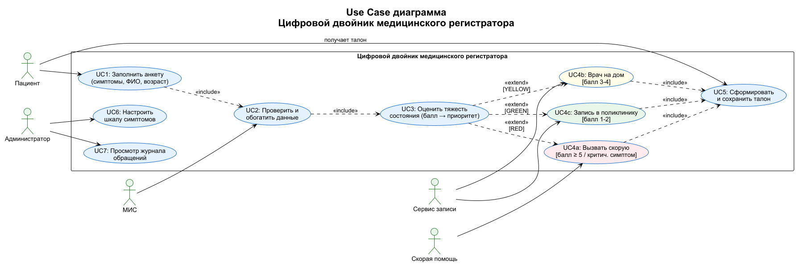

#  Цифровой двойник медицинского регистратора
> Система предварительной записи в поликлинику с автоматической триаж-сортировкой пациентов
---
# 1. Предметная область и терминология
**Цифровой двойник медицинского регистратора** — десктопное приложение, которое имитирует работу опытного регистратора: принимает анкету пациента, оценивает тяжесть состояния по балльной шкале симптомов и автоматически направляет к нужному виду медицинской помощи.

- **Медицинский регистратор** — сотрудник, который распределяет поток пациентов: оценивает срочность, назначает время, направляет к нужному врачу.
- **Триаж (Triage)**  — система сортировки пациентов по тяжести состояния (Красный → Жёлтый → Зелёный → Синий). Это твоя ключевая логика.
- **Полис ОМС/ДМС** — идентификатор пациента в медицинской системе (МИС). Через него программа проверяет, зарегистрирован ли человек.
- **Талон** — выходной документ (время, врач, кабинет, номер очереди).
- **API МИС** — внешняя система, где хранятся: регистратура, расписание врачей, история болезней.
- **API страховой компании** — туда после приёма уходит информация о факте обслуживания (для оплаты).
- **Платёжная система (опционально)** — если услуга платная или штраф за неявку.
---
### Зачем это нужно?
Реальный регистратор смотрит на симптомы и принимает решение:
- «Вызывай скорую» → 🔴 КРАСНЫЙ приоритет
- «Врача на дом» → 🟡 ЖЁЛТЫЙ приоритет  
- «Запишись на приём» → 🟢 ЗЕЛЁНЫЙ приоритет

Программа **эмулирует эти знания и действия** без участия человека.

---
##  Стек технологий

| Компонент | Технология |
|-----------|-----------|
| Язык | Java 21 |
| GUI | JavaFX 21 |
| База данных | SQLite (через JDBC) |
| Сборка | Maven (Maven Wrapper) |
| Диаграммы | PlantUML |
| IDE | IntelliJ IDEA |

---

##  Запуск проекта

### Требования
- JDK 21+
- Maven (или используй встроенный `mvnw`)

### Команда запуска
```bash
# Windows
.\mvnw.cmd javafx:run

# Linux / macOS
./mvnw javafx:run
```

База данных `med_registrator.db` создаётся автоматически в корне проекта при первом запуске.

---

##  Структура проекта
- src/main/java/main/med_registrator/
- ├── MedApplication.java          # Точка входа
- ├── config/
- │   └── ScaleConfig.java         # Шкала симптомов (правила триажа)
- ├── db/
- │   └── DatabaseManager.java     # SQLite: инициализация и CRUD
- ├── model/
- │   ├── Questionnaire.java       # Анкета пациента
- │   ├── Symptom.java             # Симптом с баллом
- │   ├── Appeal.java              # Обращение (приоритет)
- │   └── Ticket.java              # Талон
- ├── pipeline/
- │   ├── Filter.java              # Интерфейс фильтра
- │   ├── ValidationFilter.java    # Фильтр 1: валидация
- │   ├── ClassificationFilter.java# Фильтр 2: классификация
- │   ├── RoutingFilter.java       # Фильтр 3: маршрутизация + БД
- │   └── Pipeline.java            # Запуск цепочки фильтров
- ├── handler/
- │   ├── RedHandler.java          # Обработчик: скорая помощь
- │   ├── YellowHandler.java       # Обработчик: врач на дом
- │   └── GreenHandler.java        # Обработчик: запись в поликлинику
- └── controller/
- ├── MainController.java      # Главный экран (анкета)
- ├── TicketController.java    # Экран талона
- └── JournalController.java   # Журнал обращений
- src/main/resources/main/med_registrator/
- ├── main-view.fxml               # Форма анкеты
- ├── ticket-view.fxml             # Экран талона
- └── journal-view.fxml            # Журнал обращений


## 4. Диаграммы

| Контекстная диаграмма |
| :---: |
|  |
| Архитектура «каналы и фильтры» |
|  |
| ER диаграмма |
| :---: |
|  |
| Use Case |
|  |
---
##  Функциональные возможности

| ID | Функция | Статус |
|----|---------|--------|
| ФТ-1 | Приём анкеты пациента (ФИО, возраст, симптомы)
| ФТ-2 | Классификация по приоритету (балльная шкала)
| ФТ-3 | Маршрутизация к виду помощи (RED/YELLOW/GREEN) 
| ФТ-4 | Формирование и сохранение талона (TXT) 
| ФТ-5 | Интеграция с МИС (заглушка) 
| ФТ-6 | Валидация входных данных 
| ФТ-7 | Ведение журнала обращений (SQLite) 
| ФТ-8 | Передача данных в страховую (заглушка) 
| ФТ-9 | Настройка конфигурации шкалы 
---
##  Архитектура — «Каналы и фильтры»

Данные анкеты последовательно проходят через цепочку независимых фильтров:
Анкета пациента
- │ AnkData
- ▼
- ┌─────────────────┐
- │  Фильтр 1       │  Валидация полей (ФИО, возраст, симптомы)
- │  Validation     │
- └────────┬────────┘
- │ ValidData
- ▼
- ┌─────────────────┐
- │  Фильтр 2       │  Обогащение данными из МИС (заглушка)
- │  Enrichment     │
- └────────┬────────┘
- │ RichData
- ▼
- ┌─────────────────┐
- │  Фильтр 3       │  Подсчёт балла → RED / YELLOW / GREEN
- │  Classification │
- └────────┬────────┘
- │ PrioData
- ▼
- ┌─────────────────┐
- │  Фильтр 4       │  Выбор обработчика по приоритету
- │  Routing        │
- └──┬──────┬───┬───┘
- │      │   │
- RED  YELLOW GREEN
- │      │   │
- └──────┴───┘
- │ TicketData
- ▼
- ┌─────────────────┐
- │  Фильтр 5       │  Сборка объекта талона
- │  TicketBuilder  │
- └────────┬────────┘
- │ TicketObject
- ▼
- ┌─────────────────┐
- │  Фильтр 6       │  Сохранение в SQLite БД
- │  Database       │
- └────────┬────────┘
- │ PDF/TXT
- ▼
- Талон пациенту

---

## 🔴🟡🟢 Шкала триажа

| Баллы | Приоритет | Действие системы |
|-------|-----------|-----------------|
| ≥ 5 или критич. симптом | 🔴 КРАСНЫЙ | Запрос в скорую помощь (103), выдача талона с ETA |
| 3 – 4 | 🟡 ЖЁЛТЫЙ | Вызов врача на дом, постановка в очередь |
| 1 – 2 | 🟢 ЗЕЛЁНЫЙ | Запись в поликлинику (врач, кабинет, время) |

### Симптомы по категориям:

**🔴 Критические (5 баллов):**
- Нарушение или потеря сознания
- Острая боль в груди / за грудиной
- Тяжёлое нарушение дыхания (удушье)
- Обильное фонтанирующее кровотечение
- Судороги, паралич лица или конечностей

**🟡 Острые (3 балла):**
- Температура выше 38.5°C, не сбивается
- Выраженная острая боль (живот, спина, суставы)
- Резкий скачок давления с тошнотой / головокружением
- Многократная рвота или непрекращающаяся диарея
- Умеренное кровотечение из раны

**🟢 Лёгкие / плановые (1 балл):**
- Субфебрильная температура (до 38.0°C)
- Незначительные боли (головная боль, дискомфорт)
- Насморк, кашель, першение в горле
- Продление рецепта / получение справки
- Хронические жалобы без ухудшения

---

##  База данных

Файл `med_registrator.db` (SQLite) создаётся автоматически в корне проекта.

### Структура таблиц:

**`questionnaires`** — анкеты пациентов:
```sql
id, full_name, symptoms, total_score, chronic, age, created_at
```

**`appeals`** — обращения к системе:
```sql
id, questionnaire_id (FK), priority, created_at
```

**`tickets`** — выданные талоны:
```sql
id, appeal_id (FK), type, details, created_at
```

Просмотр БД: [DB Browser for SQLite](https://sqlitebrowser.org/) или вкладка **Database** в IntelliJ IDEA.

---

##  Диаграммы

### Контекстная диаграмма


### Use Case диаграмма


### Архитектура «Каналы и фильтры»


### ER-диаграмма базы данных


---

## 👤 Автор

**Евгений** — курсовой проект, 2025  
Репозиторий: [github.com/Titan0zxc/med_registrator](https://github.com/Titan0zxc/med_registrator)
